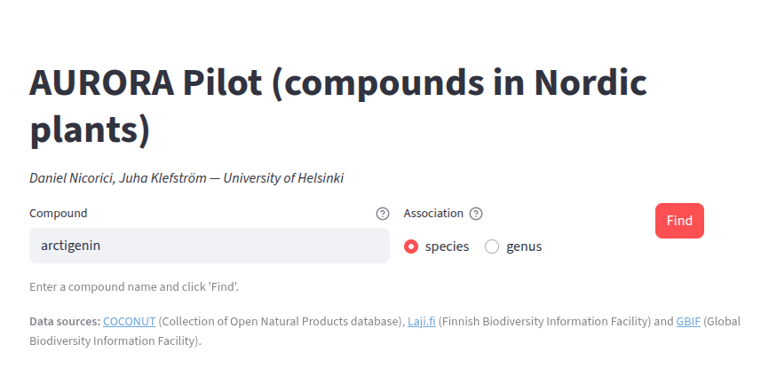
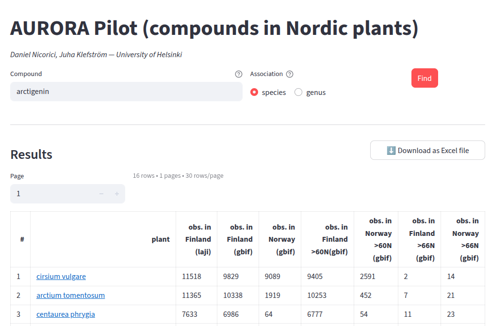

# Aurora Pilot app


[AURORA](https://aurorapilot.streamlit.app) (compounds in Nordic plants) is a Streamlit app, that integrates several plants
databases like:
- [COCONUT](https://coconut.naturalproducts.net/) (Collection of Open Natural Products database),
- [Laji.fi](https://laji.fi/) (Finnish Biodiversity Information Facility), and
- [GBIF](https://www.gbif.org/) (Global Biodiversity Information Facility).


## Screenshots

### Main search interface


### Results view


## Quickstart (local)

```bash
# create & activate a virtual environment (recommended)
python -m venv .venv
source .venv/bin/activate  # on Windows use: .venv\Scripts\activate

# install dependencies
pip install -r requirements.txt

# run the app
streamlit run app.py
```

## Data Sources & Attribution

- [COCONUT](https://coconut.naturalproducts.net/) (Collection of Open Natural Products database) - CC0 license
- [Laji.fi](https://laji.fi/) (Finnish Biodiversity Information Facility) - CC-BY license
- [GBIF](https://www.gbif.org/) (Global Biodiversity Information Facility) - CC0/CC-BY/CC-BY-NC licenses (depending on the dataset)

All rights and data terms respected according to source guidelines.

